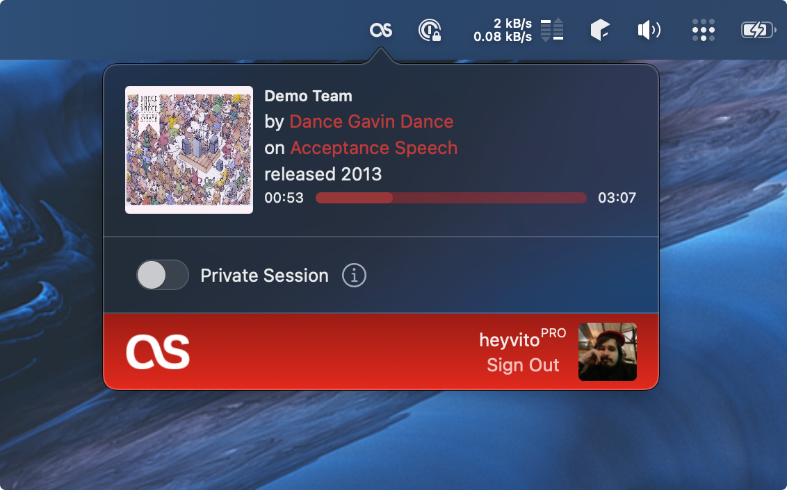

# Audioscrobbler for Apple Music


Audioscrobbler is a native macOS application capable of scrobbling tracks from Apple Music (even when
they are not in your library).

## Screenshot



## Installing

Signed and Notarized version is available on the [Releases](https://github.com/heyvito/audioscrobbler/releases) page.

## Building

1. Clone this repository
2. Open `Audioscrobbler.xcodeproj`, and build it.
3. Profit. :)

## Oh no, you pushed your token and secret!

Yep. I know! There's not much one can do with the API, and even Last.fm's tokens are [available
on their repository](https://github.com/lastfm/lastfm-desktop/blob/9ae84cf4ab204a92e6953abe14026df70c140519/lib/unicorn/UnicornCoreApplication.cpp#L58)

## Known Issues

- Audioscrobbler has a huge memory leak caused by one of Apple's API. There is no known fix at this time, and the issue has been reported multiple times through Feedback Assistant. I'm in contact with Apple engineers to see if we can sort this out.
- Music.app may restart immediately after quiting. I intend to fix this in the near future.

## TODO

- [x] Sign, Notarize & Provide DMG installer
- [x] Start at Login
- [ ] Offline support
- [ ] Auto-update

## License

Last.fm, Audioscrobbler © 2022 Last.fm Ltd. All rights reserved

```
The MIT License (MIT)

Copyright (c) 2022-2023 Victor Gama

Permission is hereby granted, free of charge, to any person obtaining a copy
of this software and associated documentation files (the "Software"), to deal
in the Software without restriction, including without limitation the rights
to use, copy, modify, merge, publish, distribute, sublicense, and/or sell
copies of the Software, and to permit persons to whom the Software is
furnished to do so, subject to the following conditions:

The above copyright notice and this permission notice shall be included in
all copies or substantial portions of the Software.

THE SOFTWARE IS PROVIDED "AS IS", WITHOUT WARRANTY OF ANY KIND, EXPRESS OR
IMPLIED, INCLUDING BUT NOT LIMITED TO THE WARRANTIES OF MERCHANTABILITY,
FITNESS FOR A PARTICULAR PURPOSE AND NONINFRINGEMENT. IN NO EVENT SHALL THE
AUTHORS OR COPYRIGHT HOLDERS BE LIABLE FOR ANY CLAIM, DAMAGES OR OTHER
LIABILITY, WHETHER IN AN ACTION OF CONTRACT, TORT OR OTHERWISE, ARISING FROM,
OUT OF OR IN CONNECTION WITH THE SOFTWARE OR THE USE OR OTHER DEALINGS IN
THE SOFTWARE.
```
